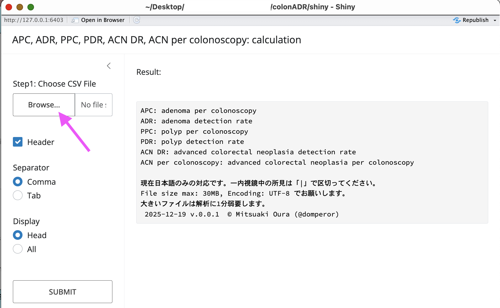
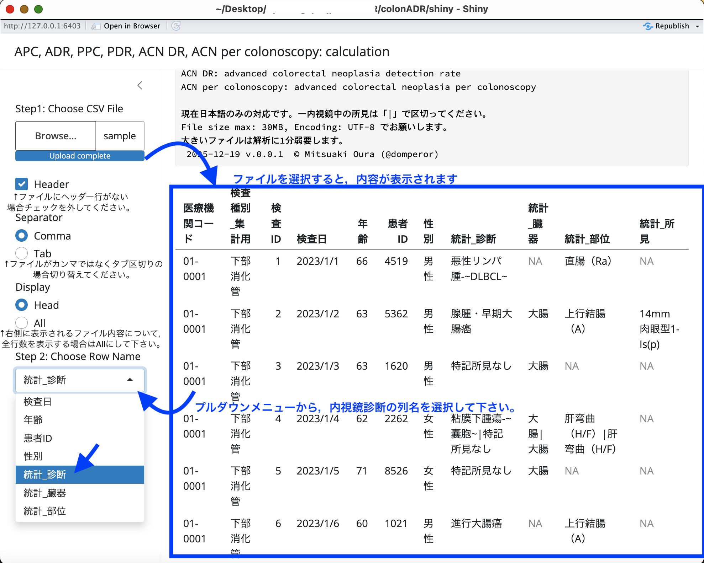

# colonADR_shiny

<!-- badges: start -->
<!-- badges: end -->

**For English description, please scroll to the bottom of this page.**

## 説明

このアプリでは，内視鏡の質の指標である

- APC：adenoma per colonoscopy
- ADR：adenoma detection rate
- PPC：polyp per colonoscopy
- PDR：polyp detection rate
- ACN DR：advanced colorectal neoplasm detection rate
- ACN per colonoscopy：advanced colorectal neoplasm per colonoscopy

をJEDスタイルの内視鏡所見データベースから計算することができます。現在日本語（エンコーディング：UTF-8）のみの対応です。

なお，デモ版は[Web（shinyapps.io）から，手軽にトライしていただけます](https://domperor.shinyapps.io/apcadrjed_shiny/)。ただし，傍受のリスクを避けるため，機微のある個人情報を扱う場合はローカル版を使用するようにしてください。

## ローカル版のインストール方法

1. このアプリはRStudio Desktop上で動作します。[まずはこちらからRStudio Desktopをインストールしてください](https://posit.co/download/rstudio-desktop/)。

2. [このフォルダ中のcolonADRapp.Rをダウンロードしてください](./colonADRapp.R)。ダウンロードボタンの位置：

3. ダウンロードしたcolonADRapp.RをRStudio Desktopで開き，▶Run App ボタンを押下してください：

## 使い方

1. Browse Fileボタンから，解析したいファイルを選択してください。手元にファイルがない場合は，[こちらのダミーデータベースでお試しいただくことも可能です](../tests/testthat/sample_CF_data.csv)。

2. 自動でファイルの中身が表示されます。内視鏡所見の記載された列について，プルダウンメニューから選んでください。なお，ファイル中では，一内視鏡中の複数所見について「|」で区切ってください（JED形式）。

3. Submit を押下します。結果が右上に表示されます。

---

## Description

This app calculate APC (adenoma per colonoscopy), ADR (adenoma detection rate), polyp per colonoscopy (PPC), polyp detection rate (PDR), advanced colorectal neoplasm detection rate (ACN DR), and advanced colorectal neoplasm per colonoscopy (ACN per colonoscopy) from JED-style database. You can easily try online the interface on [shinyapps.io](https://domperor.shinyapps.io/apcadrjed_shiny/); however, we recommend using local version when handling sensitive personal information, to avoid the risk of interception.

## How to install colonADR.app, local version

1. This app works on RStudio Desktop. [Please install RStudio Desktop from here.](https://posit.co/download/rstudio-desktop/)

2. [Please download "colonADRapp.R" from this folder.](./colonADRapp.R)。

3. Open "colonADRapp.R" with RStudio Desktop, and press ▶Run App button.

